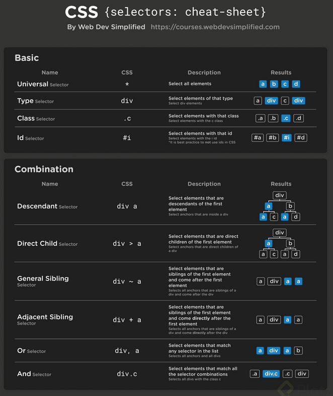

# Web Turorial - Part 1
Dieses Tutorial gibt einen groben Überblick über die gundsätzlichen Komponenten der Web-Entwicklung: HTML, CSS, JavaScript


##### Ressourcen
- F1: [https://www.formula1.com](https://www.formula1.com)
- Hartlauer: [https://www.hartlauer.at/](https://www.hartlauer.at/)
- D3 Tutorial (JKU ICG): [https://github.com/JKU-ICG/d3tutorial?tab=readme-ov-file#html](https://github.com/JKU-ICG/d3tutorial?tab=readme-ov-file#html)
- W3Schools: [https://www.w3schools.com/](https://www.w3schools.com/)
- MDN (Mozilla Developer Network) Web Docs: [https://developer.mozilla.org/de/](https://developer.mozilla.org/de/)
- MDN - Richtlinien zum Schreiben von Code: [https://developer.mozilla.org/de/docs/MDN/Writing_guidelines/Code_style_guide](https://developer.mozilla.org/de/docs/MDN/Writing_guidelines/Code_style_guide)

## Entwicklungsumgebung

### Browser Developer Tools
Die Developer Tools bieten eine Vielzahl an Tools für die Webentwicklung.

Unter anderem stehen Ihnen zur Verfügung:
- Web Inspector
  - Eigenschaften
  - CSS-Style-Selektor
- Konsole
  - In-Place-Coding
  - console.log, console.error
- Debugger
  - (Consitional) Breakpoints
  - Callstack
  - Konsolenkontext
- Profiler: Profilieren des JS-Codes auf Engpässe
- Netzwerk: Überprüfung aller Requests/Responese der Website

Jeder gängige Webbrowser (Firefox, Safari, Edge, Internet Explorer usw.) verfügt über integrierte Entwicklertools.

##### Ressourcen
- [Mozilla Web-Docs: Was sind Entwicklertools des Browsers](https://developer.mozilla.org/de/docs/Learn_web_development/Howto/Tools_and_setup/What_are_browser_developer_tools) 
- [Chrome Developer Tools](https://developer.chrome.com/docs/devtools?hl=de)
- [Firefox Developer Tools](https://firefox-source-docs.mozilla.org/devtools-user/)


### Lokaler WebServer
Die lokale Website kann auch durch öffnen der `.html` - Datei im Browser angezeigt werden (file:///).
Aus Sicherheitsgründen erlauben die meisten Browser das Laden zusätzlicher externer Files (z.B. `.json`) nicht. 

Für die Entwicklung ist daher ein lokaler WebServer notwendig. Es kann ein itegrierter Webserver der IDE verwendet werden. 

Im VSCode kann [Live Server](https://marketplace.visualstudio.com/items?itemName=ritwickdey.LiveServer) verwendet werden.

### VSCode (Visual Studio Code)
VSCode ist konstenlos und kann herunergeladen werden unter [https://code.visualstudio.com/](https://code.visualstudio.com/). Als Standard besitzt VSCode vordefinierte Shortcuts um schneller HTML-Elemente zu erstellen.

Bei der Verwendung des VSCode kann die [Live Server](https://marketplace.visualstudio.com/items?itemName=ritwickdey.LiveServer) Erweiterung verwendet werde, dabei wird auch die Website automaisch neugeladen wenn es Änderungen im Code gibt. 


##### Ressourcen
- [VSCode Erweiterungen](https://code.visualstudio.com/docs/configure/extensions/extension-marketplace)
- [Live Server](https://marketplace.visualstudio.com/items?itemName=ritwickdey.LiveServer)
- [VSCode - HTML Shortcuts](https://dev.to/peta_s/html-shortcuts-in-vs-code-35nf)
- [MDN - Richtlinien zum Schreiben von Code](https://developer.mozilla.org/de/docs/MDN/Writing_guidelines/Code_style_guide)

## HTML (HyperText Markup Language)
### HTML-Element
In HTML wird das Markup durch Elemente dargestellt. Ein HTML-Element ist ein Teil des Inhaltes der durch zwei gleichnamige Tags umgeben ist. Zum Beispiel: 
```HTML
<p>Das ist ein HTML-Element</p>
```
HTML-Elemente haben Attribute, z.B:. `id`,`class`, and `style`. Das `id`-Attribute muss einzigartig sein im gesamten HTML-Dokument.

Einige Elemtnte sind selbst schließend, das heißt `<tag />` entspricht `<tag></tag>`
```HTML

```

#### Genereller Aufbau eines HTML-Elements

Quelle: [https://codetheweb.blog/assets/img/posts/html-syntax/tag-structure-2.png](https://codetheweb.blog/assets/img/posts/html-syntax/tag-structure-2.png)

##### Ressourcen
- [tech.io - HTML syntax for beginners](https://tech.io/playgrounds/8240/html-syntax-for-beginners)
- [MDN - Liste aller HTML-Element](https://developer.mozilla.org/en-US/docs/Web/HTML/Reference/Elements)
- [MDN - Grundlegende HTML-Syntax](https://developer.mozilla.org/de/docs/Learn_web_development/Core/Structuring_content/Basic_HTML_syntax)

### HTML-Dokument
Ein HTML-Dokument besteht normalerweise aus einer Präambel und vier HTML-Tags.

Grundgerüst eines HTML-Dokuments:
- `<!DOCTYPE html>` - alle HTML-Dokumente müssen mit dieser Deklaration staretn. Diese Deklaration ist keine HTML-Tag sondern eine Information für den Browser damit dieser weiß um welchen Dokumenttypen es sich handelt.
- `<html>` - ist das Root-Element im sich alle anderen HTML-Elemente befinden. 
- `<head>` - diese Element beinhaltet die Metadaten. Metadaten sind Daten über das HTML-Dokument, diese werden nicht angezeigt.
- `<tile>` - definiert den Titel de HTML-Dokuments und ist in der Browsertitlebar bzw. im Browsertab ersichtlich.
- `<body>` - ist der Container für den Inhalt der Website.


HTML-Tags für die Metadaten:
- `<meta>` - grundsätzlich wird dier Tag verwendet für Character-Set, Beschreibung, Autor, Keywords, and Ansichtseinstellungen
- `<link>` - definiert die Beziehung zwischen dem aktuelln HTML-Dokument und externen REssourcen 
- `<style>` - wird verwendet um Styleinformation (CSS) für das HTML-Dokument zu definieren
- `<script>` - damit wird clientseitiger Code (JavaScript) eingebettet. Diese Tag beinhaltet den JS-Code selbst oder es zeigt auf externes Skript. 

Beispiel für ein typisches HTML-Dokument:
```HTML
<!DOCTYPE html>
<html lang="en">
    <head>
        <meta charset="UTF-8" />
        <meta name="description" content="Web Tutorial">
        <meta name="keywords" content="HTML, CSS, JavaScript">
        <meta name="author" content="John Doe">
        <meta name="viewport" content="width=device-width, initial-scale=1.0" />
        <link rel="stylesheet" href="style.css" />
        <script src="script.js"></script>
        <title>My HTML-Document</title>

        <style>
            * {
                font-size: 100px;
            }
        </style>

        <script>
            console.log("my first log message");
        </script>
    </head>
    <body>
        <h1>My Heading</h1>
    </body>
</html>
```

##### Ressourcen
- [web.dev- Dokumentstruktur](https://web.dev/learn/html/document-structure?hl=de)
- [MDN - Metadaten von Websiten](https://developer.mozilla.org/de/docs/Learn_web_development/Core/Structuring_content/Webpage_metadata)
- [MDN - \<meta> tag](https://developer.mozilla.org/de/docs/Web/HTML/Reference/Elements/meta)
- [MDN - Liste aller HTML-Element](https://developer.mozilla.org/en-US/docs/Web/HTML/Reference/Elements)


### DOM (Document Object Model)
Das Markup-Dokument ist eine Baumstruktur: Es hat eine Wurzel, das HTML-Element, und Elemente können untergeordnete Elemente haben, die wiederum Elemente enthalten.


Quelle: [https://terminallearning.com/devHtml/htmlDom.html](https://terminallearning.com/devHtml/htmlDom.html)


Während HTML eine textuelle Darstellung eines Markup-Dokuments darstellt, ist das DOM (Document Object Model) dessen Programmierschnittstelle. DOM-Elemente enthalten weitere interne Eigenschaften und können über JavaScript aufgerufen und geändert werden.

##### Ressourcen
- [JavaScript HTML DOM](https://www.w3schools.com/js/js_htmldom.asp)
- [MDN - Document Object Model (DOM)](https://developer.mozilla.org/en-US/docs/Web/API/Document_Object_Model)


## CSS (Cascading Style Sheets)
Cascading Style Sheets (CSS) ist eine Stylesheet-Sprache, die verwendet wird, um die Präsentation eines Dokuments zu beschreiben, das in HTML oder XML (einschließlich XML-Dialekte wie SVG, MathML oder XHTML) geschrieben wurde. CSS beschreibt, wie Elemente auf dem Bildschirm, auf Papier, in Sprache oder in anderen Medien dargestellt werden sollen.

Ein Stylesheet besteht üblicherweise aus einer Liste von CSS-Regeln, die in  `<style>`-Elemente im HTML-Header (`<head>`) eingefügt werden. Es kann auch ein externes `.css`-File referenziert werden mit dem `<link>`-Element.

Generell besteht eine CSS-Regel immer aus:
- Selektor (Selector)
- Deklaration (Declaration)
  - Eigenschaft (Property)
  - Wert (Value) / Keyword

Struktur einer CSS Regel:


Quelle: [https://css-tricks.com/css-ruleset-terminology/](https://css-tricks.com/css-ruleset-terminology/)


##### Ressourcen
- [MDN - CSS (Cascading Style Sheets)](https://developer.mozilla.org/de/docs/Web/CSS)
- [W3school - CSS Tutorial](https://www.w3schools.com/css/default.asp)


### Selektoren
Das Modul CSS-Selektoren definiert die Muster zur Auswahl von Elementen, auf die dann eine Reihe von CSS-Regeln zusammen mit deren Spezifität angewendet werden.

In CSS sind Selektoren Muster, die verwendet werden, um die Elemente zu matchen oder auszuwählen, die Sie gestalten möchten. Selektoren werden auch in JavaScript verwendet, um die Auswahl der DOM-Knoten zu ermöglichen, die als `NodeList` zurückgegeben werden.

Selektoren, unabhängig davon, ob sie in CSS oder JavaScript verwendet werden, ermöglichen das Ansprechen von HTML-Elementen basierend auf ihrem Typ, ihren Attributen, aktuellen Zuständen und sogar Positionen im DOM. 

Ein Beispiel mit verschiedenen Selektoren:
```HTML
<!DOCTYPE html>
<html lang="en">
<head>
  <meta charset="UTF-8">
  <title>CSS Example</title>
  <style>
    /* select all `div` elements */
    div {
      border: 1px solid blue;
      margin: 10px;
    }

    /* select elements having class `header` */
    .header {
      background: steelblue;
      color: white;
    }

    /* select the element with the id `main` */
    #main {
      border: 1px solid red; /* Overrides the rules from `div`, because `#main` is more specific */
    }

    /* select all `div` with class `header` */
    div.header {
      background: green; /* Overrides the rules from `.header`, because `div.header` is more specific */
    }

    /* select all descendent `p` within a `div` */
    div p {
      font-size: 200%;
    }

    /* matches when the mouse hovers a `div` */
    div:hover {
      background-color: orange;
    }
  </style>
</head>
<body>
  <div class="header">
    D3 Test
  </div>
  <div id="main">
    <p class="header">Lorem Impsum Header</p>
    <p>Lorem Impsum</p>
  </div>
</body>
</html>
```


CSS Selektor - Cheat Sheet:


Quelle [https://www.aiophotoz.com/the-ultimate-css-selectors-cheat-sheet-you-must-know-images](https://www.aiophotoz.com/the-ultimate-css-selectors-cheat-sheet-you-must-know-images-and/dGhlLXVsdGltYXRlLWNzcy1zZWxlY3RvcnMtY9hlYXQtc9hlZXQteW-1LW11c3Qta95vd3x8YWlvcGhvdG-6LmNvbXx8aHR0cHM6Ly-zdGF0aWMucGxhdHppLmNvbS-tZWRpYS-1c9VyX3VwbG-hZC-BcnRib9FyZCAxLTU0YmFlMzkzLTFkODctNGYwZC1hYTZjLWI3ZmMyZmQzZDczZi5qcGc.gif.html)

#### Pseudoklassen
Eine CSS Pseudoklasse ist ein Schlüsselwort, das einem Selektor hinzugefügt wird, um einen bestimmten Zustand der ausgewählten Elemente zu stylen. Zum Beispiel kann die Pseudoklasse `:hover` verwendet werden, um einen Button auszuwählen, wenn der Zeiger eines Nutzers über den Button schwebt, und dieser ausgewählte Button kann dann gestaltet werden.

Eine Pseudoklasse besteht aus einem Doppelpunkt `(:)`, gefolgt vom Namen der Pseudoklasse (z.B. `:hover`).

```CSS
/* Any button over which the user's pointer is hovering */
button:hover {
  color: blue;
}
```

#### Pseudo-Element
Ein CSS Pseudo-Element ist ein Schlüsselwort, das zu einem Selektor hinzugefügt wird und es Ihnen ermöglicht, einen bestimmten Teil der ausgewählten Elemente zu stylen.

Doppelte Doppelpunkte (`::`) werden für Pseudo-Elemente verwendet. Dies unterscheidet Pseudo-Elemente von Pseudo-Klassen, die in ihrer Notation einen einfachen Doppelpunkt (`:`) verwenden. Beachten Sie, dass Browser die Syntax mit einfachem Doppelpunkt für die ursprünglichen vier Pseudo-Elemente unterstützen: `::before`, `::after`, `::first-line` und `::first-letter`.

```CSS
/* The first line of every <p> element. */
p::first-line {
  color: blue;
  text-transform: uppercase;
}
```

#### Spezifität
Spezifität ist ein Algorithmus, der das angewendete Gewicht für eine gegebene CSS-Deklaration berechnet. Das Gewicht wird durch die Anzahl der Selektoren in jeder Gewichtungskategorie im Selektor bestimmt, der mit dem Element (oder Pseudo-Element) übereinstimmt. Wenn es zwei oder mehr Deklarationen gibt, die unterschiedliche Eigenschaftswerte für dasselbe Element bereitstellen, wird der Deklarationswert im Stilblock angewendet, der den übereinstimmenden Selektor mit dem größten algorithmischen Gewicht hat.
Der Spezifitätsalgorithmus ist im Grunde ein Drei-Spalten-Wert aus drei Kategorien oder Gewichten - ID, CLASS und TYPE - entsprechend den drei Arten von Selektoren

Es gibt 3 Selektor-Gewichtungskategorien (0,0,0), hier in abnehmernder Spezifität:
- ID-Spalte, z.B. `#myID`
- CLASS-Spalte, z.B. `.myClass`
- TYPE-Spalte, z.B. `p`


##### Ressourcen
- [MDN - CSS Selektoren](https://developer.mozilla.org/de/docs/Web/CSS/CSS_selectors)
- [MDN - CSS Selector-Struktur](https://developer.mozilla.org/de/docs/Web/CSS/CSS_selectors/Selector_structure#simple_selector)
- [CSS-Tricks - CSS Selectos](https://css-tricks.com/css-selectors/)
- [W3schools - CSS Selectors](https://www.w3schools.com/cssref/css_selectors.php)
- [freecodecamp.org - CSS Selectors-Cheat Sheet](https://www.freecodecamp.org/news/css-selectors-cheat-sheet-for-beginners/)
- [CSS Selekor - Cheat Sheet (Bild)](https://www.aiophotoz.com/the-ultimate-css-selectors-cheat-sheet-you-must-know-images-and/dGhlLXVsdGltYXRlLWNzcy1zZWxlY3RvcnMtY9hlYXQtc9hlZXQteW-1LW11c3Qta95vd3x8YWlvcGhvdG-6LmNvbXx8aHR0cHM6Ly-zdGF0aWMucGxhdHppLmNvbS-tZWRpYS-1c9VyX3VwbG-hZC-BcnRib9FyZCAxLTU0YmFlMzkzLTFkODctNGYwZC1hYTZjLWI3ZmMyZmQzZDczZi5qcGc.gif.html)
- [MDN - Pseudoklassen](https://developer.mozilla.org/de/docs/Web/CSS/Pseudo-classes)
- [MDN - Pseudo-Elemente](https://developer.mozilla.org/de/docs/Web/CSS/Pseudo-elements)
- [MDN - Spezifität](https://developer.mozilla.org/de/docs/Web/CSS/CSS_cascade/Specificity)


### Layout
Mit CSS-Seitenlayout-Techniken können Elemente auf einer Webseite positioniert werden, relativ zu den folgenden Faktoren: ihrer Standardposition im normalen Layoutfluss, den anderen sie umgebenden Elementen, ihrem übergeordneten Container und dem Hauptsichtfeld/Fenster.

#### Ressources
- [MDN - Einführung in das CSS Layout](https://developer.mozilla.org/de/docs/Learn_web_development/Core/CSS_layout/Introduction)
- [MDN -  display CSS Property](https://developer.mozilla.org/de/docs/Web/CSS/display)
- [W3schools - CSS Layout: The display Property](https://www.w3schools.com/css/css_display_visibility.asp)
- [freecodecamp.org - The CSS Display Property](https://developer.mozilla.org/de/docs/Web/CSS/display)

#### Grid-Layout
Das CSS-Grid-Layout ist ein zweidimensionales Layoutsystem für das Web. Es können Inhalte in Zeilen und Spalten organisiert werden und bietet viele Funktionen, um das Erstellen komplexer Layouts zu vereinfachen.


Quelle: [https://css-tricks.com/snippets/css/complete-guide-grid/#aa-grid-template-areas](https://css-tricks.com/snippets/css/complete-guide-grid/#aa-grid-template-areas)

##### Beispiel
```CSS
.container {
  display: grid;
  grid-template-columns: 1fr 1fr 1fr 250px;
  grid-template-rows: 100px 1fr 1fr;
  grid-template-areas: 
    "header header header header"
    "main main . sidebar"
    "footer footer footer footer";
}

.item {
  grid-column-start: 2;
  grid-column-end: five;
  grid-row-start: row1-start;
  grid-row-end: 3;
  align-self: center;
}
```

###### Ressourcen
- [MDN - CSS-Grid-Layout (Learn Web-Dev)](https://developer.mozilla.org/de/docs/Learn_web_development/Core/CSS_layout/Grids)
- [MDN - CSS-Grid-Layout](https://developer.mozilla.org/de/docs/Web/CSS/CSS_Grid_Layout.)
- [css-tricks - CSS Grid Layout Guide](https://css-tricks.com/snippets/css/complete-guide-grid/)


#### Flexbox-Layout
Flexbox ist eine eindimensionale Layoutmethode zum Anordnen von Elementen in Zeilen oder Spalten. Elemente flexen (dehnen sich aus), um zusätzlichen Raum zu füllen oder ziehen sich zusammen, um in kleinere Räume zu passen.


Quelle: [https://css-tricks.com/snippets/css/a-guide-to-flexbox/#aa-justify-content](https://css-tricks.com/snippets/css/a-guide-to-flexbox/#aa-justify-content)

##### Beispiel
```CSS
.container {
  display: flex;
  flex-direction: row;
  justify-content: space-between;
}

.item {
  flex-grow: 1;
  flex-shrink: 0;
  align-self: center;
}
```


###### Ressourcen
- [MDN - Flexbox (Learn Web-Dev)](https://developer.mozilla.org/de/docs/Learn_web_development/Core/CSS_layout/Flexbox)
- [MDN - CSS Flexible Box Layout](https://developer.mozilla.org/de/docs/Web/CSS/CSS_flexible_box_layout)
- [css-tricks - CSS Flexbox Layout Guide](https://css-tricks.com/snippets/css/a-guide-to-flexbox/)


## JavaScript
JavaScript ist eine plattformübergreifende, objektorientierte Skriptsprache, die verwendet wird, um Webseiten interaktiv zu gestalten (zum Beispiel komplexe Animationen, klickbare Buttons, Popup-Menüs usw.).
In einer Host-Umgebung (zum Beispiel einem Webbrowser) kann JavaScript mit den Objekten seiner Umgebung verbunden werden, um programmatische Kontrolle über diese zu bieten.

JavaScript enthält eine Standardbibliothek von Objekten, wie `Array`, `Map` und `Math`, und einen Kernsatz von Sprachelementen wie Operatoren, Kontrollstrukturen und Anweisungen.

```JS
// Numbers:
let length = 16;
let weight = 7.5;

// Strings:
let color = "Yellow";
let lastName = "Johnson";

// Booleans
let x = true;
let y = false;

// Object:
const person = {firstName:"John", lastName:"Doe"};

// Array object:
const cars = ["Saab", "Volvo", "BMW"];

// Date object:
const date = new Date("2022-03-25"); 
```


###### Ressourcen:
- [MDN - JavaScript](https://developer.mozilla.org/de/docs/Web/JavaScript)
- [MDN - JavaScript Einführung](https://developer.mozilla.org/de/docs/Web/JavaScript/Guide/Introduction)
- [MDN - JavaScript-Datentypen und Datenstrukturen](https://developer.mozilla.org/de/docs/Web/JavaScript/Guide/Data_structures)
- [W3school - JavaScript Tutorial](https://www.w3schools.com/js/default.asp)
- [W3school - JavaScript Data Types](https://www.w3schools.com/js/js_datatypes.asp)

### ECMA
JavaScript ist standardisiert bei [Ecma International](https://ecma-international.org/) — der europäischen Organisation zur Standardisierung von Informations- und Kommunikationssystemen (ECMA war früher ein Akronym für die European Computer Manufacturers Association), um eine standardisierte, internationale Programmiersprache auf Basis von JavaScript zu liefern. Diese standardisierte Version von JavaScript, genannt ECMAScript, verhält sich in allen Anwendungen, die den Standard unterstützen, gleich. Unternehmen können die offene Standardsprache nutzen, um ihre Implementierung von JavaScript zu entwickeln. Der ECMAScript-Standard ist in der ECMA-262-Spezifikation dokumentiert.

##### Ressourcen:
- [Ecma Internatinal](https://ecma-international.org/)

### JSON (JavaScript Object Notation)
JavaScript Object Notation (JSON) ist ein standardisiertes, textbasiertes Format zur Darstellung strukturierter Daten, basierend auf der Syntax von JavaScript-Objekten. Es wird häufig für die Übertragung von Daten in Webanwendungen verwendet (z. B. um Daten vom Server zum Client zu senden, damit diese auf einer Webseite angezeigt werden, oder umgekehrt). Sie werden es häufig antreffen, daher bieten wir Ihnen in diesem Artikel alles, was Sie benötigen, um mit JSON in JavaScript zu arbeiten, einschließlich des Analysierens von JSON, damit Sie auf die darin enthaltenen Daten zugreifen können, und des Erstellens von JSON.

```JSON
{
    "firstName": "John",
    "lastName": "Snow",
    "age": 25,
    "children": [],
    "spouse": null,
    "address": {
        "street": "7504 Taylor Drive",
        "city": "New York City",
        "state": "New York",
        "postalCode": "11238"
    },
    "phoneNumbers": [
        {
            "type": "mobile",
            "number": "212 555-3346"
        },
        {
            "type": "fax",
            "number": "646 555-4567"
        }
    ]
}
```

##### Ressourcen
- [MDN - Arbeiten mit JSON](https://developer.mozilla.org/de/docs/Learn_web_development/Core/Scripting/JSON)
- [Techie Delight - JSON Tutorial – Introduction, Structure, Syntax Rules, and Data Exchange](https://www.techiedelight.com/json-introduction/)
- [W3schools - JSON - Introduction](https://www.w3schools.com/js/js_json_intro.asp)

### Var, Let, Const
In JavaScript verwenden wir sowohl die Schlüsselwörter `let` als auch `var`, um Variablen zu deklarieren.

Einige Leute denken, dass diese beiden Schlüsselwörter austauschbar verwendet werden können, aber das stimmt nicht. Die Hauptunterschiede zwischen den beiden können zu schwerwiegenden Fehlern in unserer Programmierung führen.

Vor dem ES6-Update auf JavaScript gab es nur eine Möglichkeit, Variablen und Konstanten in JavaScript zu deklarieren. Aber seit dem ES6-Update haben wir jetzt die Schlüsselwörter `let` und `const`, die zum Deklarieren von Variablen und Konstanten verwendet werden.

Einer der Hauptgründe für das Hinzufügen der Schlüsselwörter `let` und `const` zu JavaScript war, dass die mit dem Schlüsselwort `var` deklarierte Variable nicht der Block war, in dem sie deklariert wurde. Stattdessen war sein Umfang auf die Funktion beschränkt, was einige Programmierprobleme verursachte.

##### Beispiel
```JS
 var cnt = 0;
 var test = 'test';

 let amount = 0;
 let happy = 'sugar';

 const maxNumber = 5;
 const myName = 'name';
```

##### Ressource
- [DekftStack - Unterschied zwischen let und var in JavaScript](https://www.delftstack.com/de/howto/javascript/javascript-let-vs-var/)
- [MDN - var](https://developer.mozilla.org/de/docs/Web/JavaScript/Reference/Statements/var)
- [MDN - let](https://developer.mozilla.org/de/docs/Web/JavaScript/Reference/Statements/let)
- [MDN - const](https://developer.mozilla.org/de/docs/Web/JavaScript/Reference/Statements/const)
- [freecodecamp.org - Var, Let, Const - What's the Difference?](https://www.freecodecamp.org/news/var-let-and-const-whats-the-difference/)
- [GeeksForGeeks - Differnece between var, let, and const keywords in JavaScript](https://www.geeksforgeeks.org/difference-between-var-let-and-const-keywords-in-javascript/)

### Console
Das console-Objekt bietet Zugriff auf die Debugging-Konsole (z. B. die Web-Konsole in Firefox).

Implementierungen der Console-API können sich je nach Laufzeitumgebung unterscheiden. Insbesondere können einige `console`-Methoden in einigen Online-Editoren und Entwicklungsumgebungen (IDEs) unterschiedlich funktionieren oder überhaupt nicht verfügbar sein. 

```JS
// log message
console.log("test");

// debug message
console.debug("debug");

// warnung
console.warn("warn");

//error
console.error("error");


for (let i=0;i<maxCnt;i++) {
  console.count("loop-counter");
}
```

##### Ressourcen
- [MDN - console](https://developer.mozilla.org/de/docs/Web/API/console)
- [W3schools - Window Console Object](https://www.w3schools.com/jsref/obj_console.asp)

### Equals
JavaScript bietet drei verschiedene Methoden zum Wertevergleich:
- `===` — strikte Gleichheit (dreifach gleich)
- `==` — lose Gleichheit (doppelt gleich)
- `Object.is()`

Welche Methode gewählt wird, hängt davon ab, welche Art von Vergleich durchgeführt werden soll.
Kurz gesagt:

- Doppelt gleich (`==`) führt eine Typkonvertierung durch, wenn zwei Dinge verglichen werden, und behandelt `NaN`, `-0` und `+0` speziell gemäß IEEE 754 (also `NaN != NaN` und `-0 == +0`);
- Dreifach gleich (`===`) führt denselben Vergleich wie doppelt gleich durch (einschließlich der speziellen Behandlung für `NaN`, `-0` und `+0`), jedoch ohne Typkonvertierung; wenn die Typen unterschiedlich sind, wird `false` zurückgegeben.
- `Object.is()` führt keine Typkonvertierung und keine spezielle Behandlung für `NaN`, `-0` und `+0` durch (was ihm dasselbe Verhalten wie `===` gibt, abgesehen von diesen speziellen numerischen Werten).


##### Ressourcen
- [MDN - Gleichheitsvergleiche und Gleichheit](https://developer.mozilla.org/de/docs/Web/JavaScript/Guide/Equality_comparisons_and_sameness)
- [W3schools - JavaScript Comparison and Logical Operators](https://www.w3schools.com/js/js_comparisons.asp)
- [GeeksForGeeks - JavaScript ‘===’ vs ‘==’Comparison Operator](https://www.geeksforgeeks.org/javascript-vs-comparison-operator/)

### Selektion von HTML - Elementen
In JavaScript gibt es verschiedene Möglichkeiten ein bzw. mehrere HTML - Elemente auszuwählen:
- `getElementById`
- `getElementsByClassName`
- `getElementsByTagName`
- `getElementsByName`
- `querySelector`
- `querySelectorAll`

Für die beiden Methoden `querySelector` und `querySelectorAll` werden Selektoren angegeben die den der CSS Selektoren entsprechen, z.B. `querySelector(#id)`, `querySelectorAll(.class)`

```HTML
<!DOCTYPE html>
<html lang="en">

<head>
    <meta charset="UTF-8">
    <meta name="viewport" content="width=device-width, initial-scale=1.0">
    <title>Selektion: HTML-Element</title>
</head>
<body>
  <div>
    <h2 id="myHeading">Hi there!</h2>
    <p class="myParagraphs">Look at us,</p>
    <p class="myParagraphs">we’re a group</p>
    <p class="myParagraphs theLastParagraph" name="theLastOne">of paragraph tags.</p>
  </div>
</body>
<script>
// --- getElementBy
// selects the element with id="myHeading" 
let mainHeading = document.getElementById("myHeading"); 

// ---  getElementsBy
// selects all elements with class = "myParagraphs"
let allParagraphs = document.getElementsByClassName("myParagraphs");
// selects all elements with the <p> - tag
let allParagraphs = document.getElementsByTagName("p");
// selects all elements with name = "theLastOne"
let theLastOne = document.getElementsByName("theLastOne");

// ---  querySelector
// selects the element with id="myHeading" 
let mainHeading = document.querySelector("#myHeading");
// selects the first element with a <h2> - tag that is a descendent of an <div> - element
let mainHeading = document.querySelector("div h2");

// ---  querySelectorAll
// selects all elements that is <p> - tag with class 'theLastParagraph' and is a descendent of an <div> element
let lastParagraph = document.querySelectorAll("div p.theLastParagraph")

</script>
</html>
```

##### Ressourcen
- [MDN -  getElementByID](https://developer.mozilla.org/de/docs/Web/API/Document/getElementById)
- [MDN -  getElementsByClassName](https://developer.mozilla.org/de/docs/Web/API/Document/getElementsByClassName)
- [MDN -  getElementsByTagName](https://developer.mozilla.org/de/docs/Web/API/Document/getElementsByTagName)
- [MDN -  getElementsByName](https://developer.mozilla.org/de/docs/Web/API/Document/getElementsByName)
- [MDN -  querySelector](https://developer.mozilla.org/de/docs/Web/API/Document/querySelector)
- [MDN -  querySelectorAll](https://developer.mozilla.org/de/docs/Web/API/Document/querySelectorAll)
- [bydavidlange.com - 6 Ways to select HTML Elements with Javascript](https://bydavidlange.com/6-ways-to-select-html-elements-with-javascript/)
- [GeeksForGeeks - How to select DOM Elements in JavaScript ?](https://www.geeksforgeeks.org/how-to-select-dom-elements-in-javascript/)

### Promises
Ein Promise ist die Zusicherung oder Garantie, dass etwas in der Zukunft passieren wird.

Mit dieser Zusicherung (Promise) gehen zwei mögliche Ergebnisse einher: Erfüllung (fulfillment) oder Nichterfüllung (failure). Ein Psomise ist an ein Ergebnis geknüpft, das seine Erfüllung bestätigt. Tritt dieses Ergebnis nicht ein, ist das Promise nicht erfüllt. Ein Promoise muss am Ende eines dieser Ergebnisse haben.

In JavaScript ist ein Promise ein Objekt, das irgendwann in der Zukunft einen einzelnen Wert erzeugt. Ist das Promise erfolgreich, wird ein gültiger Wert erzeugt. Geht jedoch etwas schief, wird ein Grund für das Nichterfüllen des Promises angegeben. Die möglichen Ergebnisse ähneln denen von Promise im wirklichen Leben.

JavaScript-Promise können einen von drei möglichen Zuständen annehmen. Diese Zustände zeigen den Fortschritt des Promises an. Sie sind:
- Ausstehend (pending): Dies ist der Standardzustand eines definierten Promises.
- Erfüllt (fulfilled): Dies ist der Zustand eines erfolgreichen  Promises.
- Abgelehnt (rejected): Dies ist der Zustand eines fehlgeschlagenen Promises.

Ein Promise wechselt von pending zu fulfilled oder von pending zu rejected - fulfilled und rejected kennzeichnen das Ende eines Versprechens.

Ein `Promise` ist ein Objekt das als Übergabeparameter im Konstruktor ein Funtion hat, diese Funktion hat 2 Parameter, `resolve` und `reject`.
`resolve` und `reject` sind eigentlich auch Funktionen die aufgerufen werden abhängig vom Ausgang der asynchronen Operation.

Wenn ein Promise erzeugt wird befindet es sich im 'pendings' - Status. Wenn die `resolve` Funktion aufgerufen wird geht das Promise in den 'fulfilled' - Status, wird die `reject` Funktion aufgerufen geht es in den 'rejected' - Status. 

**Beispiel - Promise erstellen**
```JS
const promise = new Promise((resolve, reject) => {
  setTimeout(function() {
    const sum = 4 + 5;
    if(isNaN(sum)) {
      reject('Error while calculating sum.');
    } else {
      resolve(sum);
    }
  }, 2000);
});

```
**Hinweis**: Die `resolve` und `reject` Funktionen können beliebig umgebnannt werden.

Die `setTimeout` Funktion wird verwendet um einen Code zeitverzögert auszuführen. In diesem Beispiel wird nach `2000` ms (2 Sekunden) das Promises der Summe von  4 + 5 aufgelöst.


Um das Ergebnis des Promises zu verwnden müssen Callbacks definiert werden, dafür werden `.then` und `.catch` verwendet.

**Beispiel - Promiseergebiss verwenden**
```JS
const promise = new Promise((resolve, reject) => {
  setTimeout(function() {
    const sum = 4 + 5;
    if(isNaN(sum)) {
      reject('Error while calculating sum.');
    } else {
      resolve(sum);
    }
  }, 2000);
});

promise.then((result) => {
  console.log(result);
}).catch((error) => {
  console.error(error);
})
```
**Hinweis**: Die `result` und `error` Parameter können beliebig umgebnannt werden.

Jedesmal wenn `resolve` aufgerufen wird, gibt das Promise den Wert der der `resolve` Funktion übergeben wurde zurück. Dieser Wert kann dann mit der `then` Funktion abgerufen werden.

Bei einer fehlerhaften Operation wird die `reject` Funktion aufgerufen. Der Wert der dieser Funktion übergeben wurde kann dann mit der `catch` Funktion abgerufen werden.


#### Async / await
`Async` und `await` erlaub eine einfachere Handhabung von Promises. 

Immer wenn das `async` zu einer Funktion hinzugefügt wird, gibt die Funktion ein Promise zurück.
Um `await` verwenden zu können muss die die Funktion als `async` deklaiert werden.

Beispiel eines promises die das Produkt von 2 Zahlen bildet.
```JS
function getProduct(a, b) {
  return new Promise(function (resolve, reject) {
    setTimeout(function () {
      resolve(a * b);
    }, 1000);
  });
}
```

Vergleich von `then`/`catch` und `async`/`await`
```JS
// then / catch
getProduct(2, 4)
  .then(function (result) {
    getProduct(result, 2)
      .then(function (finalResult) {
        console.log('final_result', finalResult);
      })
      .catch(function (error) {
        console.log(error);
      });
  })
  .catch(function (error) {
    console.log(error);
  });


// async / await
const printResult = async () => {
  try {
    const result = await getProduct(2, 4);
    const finalResult = await getProduct(result, 2); 
    console.log('final_result', finalResult); 
  } catch (error) {
    console.log(error);
  }
};

printResult();
```
**Hinweis:** Es muss immer ein `try`/`catch` - Block um das `await` verwendet werden damit bei einem abgelehnten Promise der relevante Code im `catch` - Blcok ausgefüher werden kann.

Der Code der `async`/`await` verwendet ist cleaner und auch einfacher zu verstehen als die Verkettung der Promises mit `then`.


##### Ressourcen
- [freecodecamp.org - How Promises Work in JavaScript – A Comprehensive Beginner's Guide](https://www.freecodecamp.org/news/guide-to-javascript-promises/)
- [freecodecamp.org - How to Use JavaScript Promises – Callbacks, Async/Await, and Promise Methods Explained](https://www.freecodecamp.org/news/javascript-promises-async-await-and-promise-methods/)
- [MDN - setTimeout](https://developer.mozilla.org/de/docs/Web/API/Window/setTimeout)
- [MDN - Verwendung von Promises](https://developer.mozilla.org/de/docs/Web/JavaScript/Guide/Using_promises)
- [MDN - Promise](https://developer.mozilla.org/de/docs/Web/JavaScript/Reference/Global_Objects/Promise)
- [W3schools - JavaScript Promises](https://www.w3schools.com/Js/js_promise.asp)
- [GeeksForGeeks - JavaScript Promise](https://www.geeksforgeeks.org/javascript-promise/)
- [andyshora.com - Promises in AngularJS, Explained as a Cartoon](https://www.andyshora.com/promises-angularjs-explained-as-cartoon.html)
- [W3schools - JavaScript Async](https://www.w3schools.com/Js/js_async.asp)
- [dev.to - A key difference between .then and aysnc-await in JavaScript](https://dev.to/kylejb/a-key-difference-between-then-and-async-await-in-javascript-53e9)


